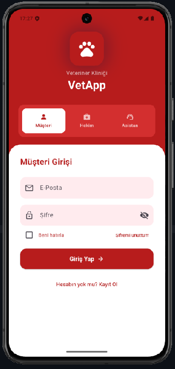
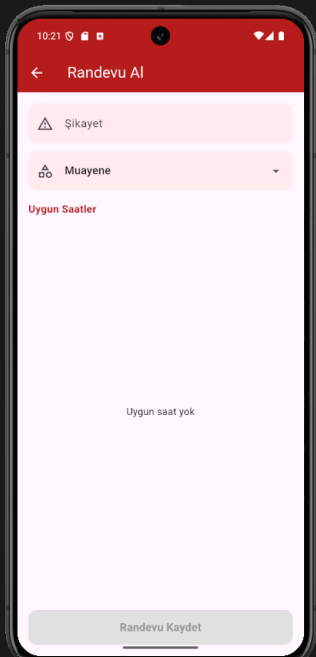
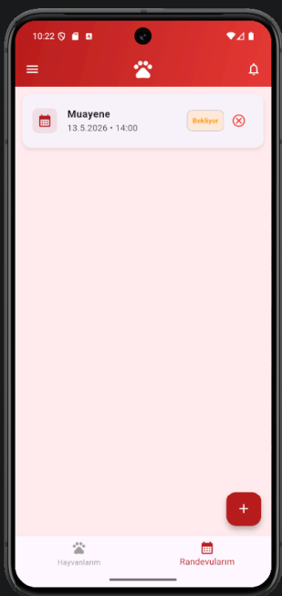

# 🐾 Veteriner Klinik Yönetim Uygulaması

Veteriner klinikleri için randevu, hasta kaydı ve aşı takibini tek uygulamada
toplayan çok platformlu (Android / iOS / web) bir klinik yönetim uygulaması.

Haliç Üniversitesi Bilgisayar Programcılığı **bitirme projesi** olarak geliştirildi ve
akademik tez ile belgelendi; mezuniyetten sonra tek klinikten çok klinikli bir yapıya
taşınarak geliştirilmeye devam ediyor.

## Problem

Veteriner kliniklerinde randevu, hasta geçmişi ve aşı takibi büyük ölçüde telefon,
defter ve Excel üzerinden yürütülüyor. Bu, yoğun saatlerde çift randevuya, kaçırılan
aşı tarihlerine ve hasta geçmişine ulaşamamaya yol açıyor. Uygulama bu üç süreci
tek yerde topluyor.

## Roller

Uygulama üç ayrı kullanıcı rolü ile çalışır; her rol açılışta kendi ana ekranına düşer
ve yalnızca kendi yetkisindeki verileri görür.

| Rol | Neler yapabilir |
|---|---|
| **Müşteri** (hayvan sahibi) | Hayvanlarını kaydeder, uygun saatlerden randevu alır, randevularını ve hayvanının tıbbi kayıtlarını / aşılarını görüntüler |
| **Hekim** | Kendi randevu listesini görür, muayene sonrası tıbbi kayıt ve aşı girer, yaklaşan aşıları takip eder |
| **Asistan** | Randevu saatlerini (slot) açar, randevuları yönetir, kullanıcı ve hayvan kayıtlarını düzenler |

## Özellikler

- **Rol bazlı kimlik doğrulama ve yetkilendirme** — Firebase Authentication; her rol için ayrı giriş akışı ve ana ekran
- **Çok klinikli (multi-tenant) yapı** — her kayıt bir kliniğe bağlıdır; bir klinik yalnızca kendi verisini görür
- **Randevu yönetimi** — asistanın açtığı uygun saatler (slot) üzerinden randevu oluşturma, listeleme, detay ve iptal
- **Hayvan kayıtları** — hayvan ekleme, detay ve profil fotoğrafı
- **Tıbbi kayıtlar** — muayene geçmişinin hayvan bazında tutulması ve listelenmesi
- **Aşı takibi** — yapılan aşıların kaydı ve yaklaşan aşıların ayrı ekranda listelenmesi
- **Bildirim paneli** — kullanıcıya yaklaşan randevu ve aşı hatırlatmalarının gösterilmesi
- **Kullanıcı yönetimi** — klinik personelinin kullanıcı ve rol düzenlemesi
- **Firestore güvenlik kuralları** — yetkilendirme yalnızca arayüzde değil, veritabanı kuralları ile de zorunlu kılınır
- **Tek kod tabanı** — Flutter ile Android, iOS ve web

## Kullanılan Teknolojiler

| Katman | Teknoloji |
|---|---|
| Arayüz / uygulama | Flutter, Dart |
| Kimlik doğrulama | Firebase Authentication |
| Veritabanı | Cloud Firestore (güvenlik kuralları ve indeksler depoda) |
| Dosya saklama | Firebase Storage (hayvan fotoğrafları) |
| Yardımcı betikler | Node.js (firebase-admin) |
| Geliştirme ortamı | Visual Studio Code, Git |

## Proje Yapısı

```
lib/
  model/     # Veri modelleri (kullanıcı, hayvan, randevu, slot, tıbbi kayıt, aşı, klinik)
  servis/    # Firestore ve Auth erişim katmanı (oturum, randevu, aşı, tıbbi kayıt, klinik)
  view/      # Ekranlar — rol bazlı ana sayfalar, randevu, tıbbi kayıt, aşı, yönetim
firestore.rules          # Veritabanı yetkilendirme kuralları
firestore.indexes.json   # Sorgu indeksleri
tools/klinik_gocu.js     # Eski kayıtları klinik yapısına taşıyan veri göç betiği
```

Mimari üç katmana ayrılmıştır: ekranlar (`view`) doğrudan Firestore'a erişmez,
veri erişimi `servis` katmanı üzerinden yapılır ve `model` sınıfları ile taşınır.

## Ekran Görüntüleri

<p align="center">
  
  
  
</p>

## Kurulum

```bash
git clone https://github.com/Fiikss/veteriner-app.git
cd veteriner-app
flutter pub get
flutter run
```

> Uygulamanın çalışabilmesi için kendi Firebase projenizi oluşturup
> `google-services.json` (Android) ve `GoogleService-Info.plist` (iOS) dosyalarını
> ilgili klasörlere eklemeniz gerekir. Firestore kurallarını yüklemek için:
> `firebase deploy --only firestore:rules`

## Geliştirici

**Melikegül Keser**
Bilgisayar Programcılığı — Haliç Üniversitesi
[LinkedIn](https://www.linkedin.com/in/melikegulkeser) · melikeglkeser@gmail.com
